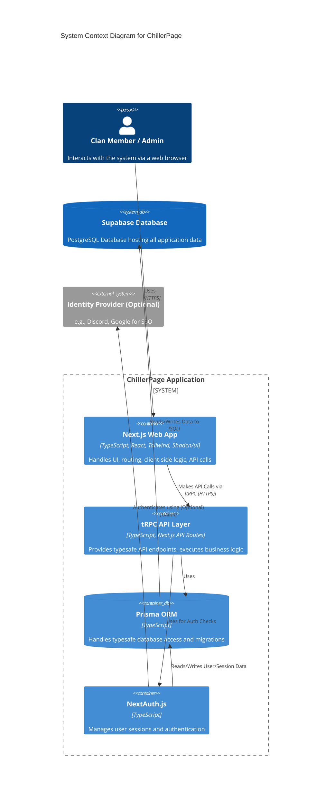
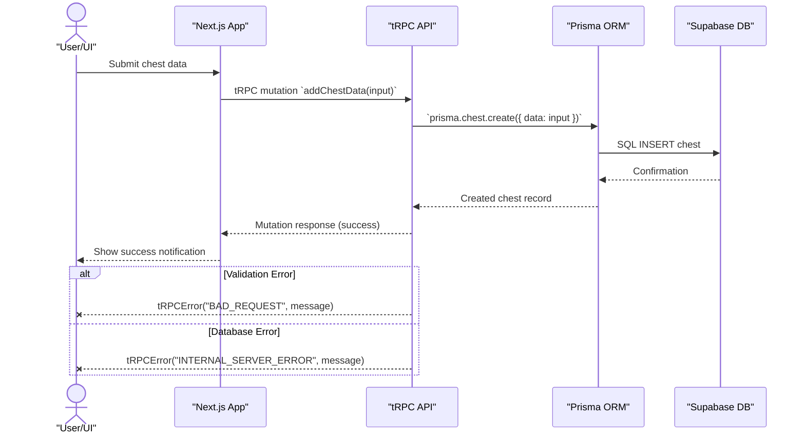
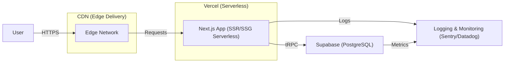
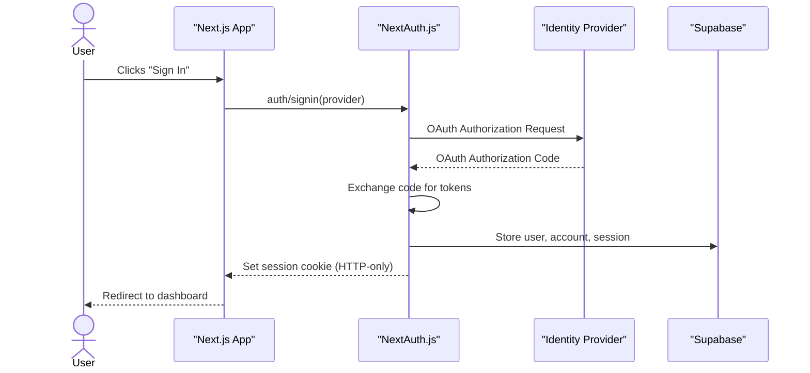

# Architecture Overview - ChillerPage

<!-- Table of Contents -->
- [Architecture Overview - ChillerPage](#architecture-overview---chillerpage)
  - [1. System Context](#1-system-context)
  - [2. Container Diagram (Conceptual)](#2-container-diagram-conceptual)
  - [3. High-Level Diagram](#3-high-level-diagram)
  - [4. Sequence Diagram](#4-sequence-diagram)
  - [5. Infrastructure Diagram](#5-infrastructure-diagram)
  - [6. Authentication Flows](#6-authentication-flows)
  - [7. Architectural Decision Records](#7-architectural-decision-records)

This document provides a high-level overview of the ChillerPage application architecture.

## 1. System Context

ChillerPage is a web application built using Next.js, providing a platform for "Total Battle" clan members to manage chest data, view statistics, communicate, and access clan-specific information.

*   **Users:** Interact with the application via web browsers (Desktop, Tablet, Mobile).
*   **System:** The core ChillerPage application, hosted potentially on Vercel.
*   **Database:** Supabase (PostgreSQL) instance storing all application data (users, clans, chest data, rules, etc.).
*   **Authentication:** Handled by NextAuth.js, potentially interacting with external identity providers (e.g., Discord, Google - TBD) or using database credentials.

## 2. Container Diagram (Conceptual)

The primary components within the ChillerPage system boundary are:

1.  **Next.js Frontend App:**
    *   Built with React (Server and Client Components), TypeScript, Tailwind CSS, Shadcn/ui.
    *   Handles UI rendering, routing (App Router), user interactions, and client-side state.
    *   Communicates with the backend API layer via tRPC.
2.  **Next.js API Layer (tRPC):**
    *   Hosted within the same Next.js application (API Routes).
    *   Provides typesafe procedures for data fetching, mutations, authentication checks, and business logic execution.
    *   Interacts with the database via Prisma ORM.
3.  **Prisma ORM:**
    *   Provides typesafe database access, schema management, and migrations.
    *   Connects the API layer to the Supabase database.
4.  **Supabase Database:**
    *   PostgreSQL database hosted by Supabase.
    *   Stores all persistent application data defined in `prisma/schema.prisma`.
5.  **NextAuth.js:**
    *   Handles user authentication flows (login, logout, session management).
    *   Integrates with the Next.js application and potentially external providers.

## 3. High-Level Diagram

*Diagram Notes:*
*   The Next.js App, tRPC API, Prisma, and NextAuth.js components are tightly integrated within the same Next.js project structure.
*   Data flow primarily involves the User interacting with the Next.js App, which calls the tRPC API. The API uses Prisma to interact with the Supabase DB and NextAuth.js for session/auth verification.

## 4. Sequence Diagram

## 5. Infrastructure Diagram

## 6. Authentication Flows

We use **NextAuth.js** to manage OAuth and session storage:

1. **OAuth Sign-In**  

2. **Session Retrieval**  
On each request, Next.js calls NextAuth's `getSession()`, which reads the session cookie and fetches session data from Supabase.  

Sessions and accounts are stored in Supabase tables: `accounts`, `sessions`, `users`.

## 7. Architectural Decision Records

We track major design choices in ADRs located under `docs/adr/`:

| ADR  | Title                         | Status   | Date       |
|------|-------------------------------|----------|------------|
| 001  | Next.js & tRPC as core stack | Accepted | 2023-08-01 |
| 002  | Use Supabase for persistence  | Accepted | 2023-08-05 |
| 003  | NextAuth.js for auth          | Proposed | 2023-09-10 |

Future ADRs should be added following the [ADR template](docs/adr/template.md).
